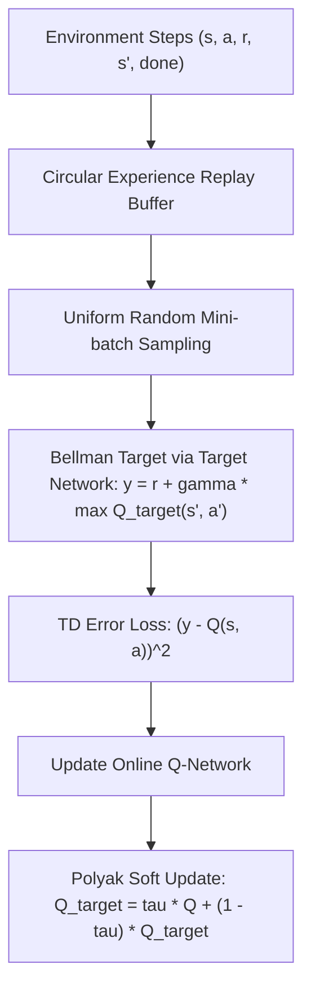

# genpark-dqn-replay-buffer-target-network-skill

Agent Skill implementing the **DQN Experience Replay Buffer and Polyak Soft Target Network Averaging**, stabilizing off-policy temporal difference reinforcement learning.

## Architectural Overview

